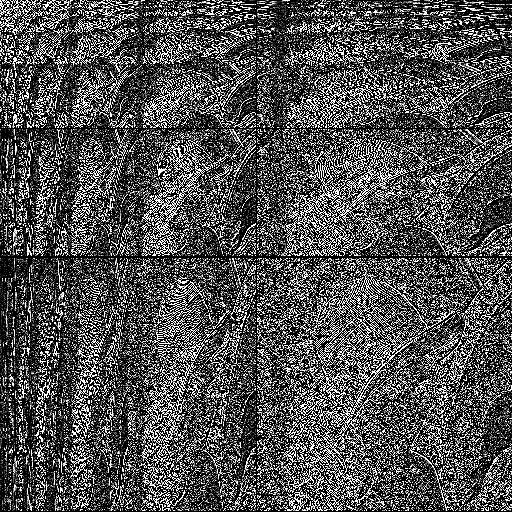

> Developed with [Giuseppe Marino](https://github.com/giuseppe16180)

## Discrete wavelet transform

[Wavelets](https://en.wikipedia.org/wiki/Wavelet_transform) can be used to analyze the frequencies of a signal (an image, in this case).

The file `dwt.m` implements the [Haar wavelet transform](https://en.wikipedia.org/wiki/Haar_wavelet) using a combination of high pass and low pass filters, while `idwt.m` provides the inverse transform to go back to the original image. The transformed image is suitable for applying compression techniques.

The file `dwt_a_trous.m` implements the [à trous](https://en.wikipedia.org/wiki/Stationary_wavelet_transform) algorithm, starting with the kernel `[1 2 1]` which is then upsampled, filled with zeros. This is in contrast to the downsampling of the signal performed in `dwt.m`. The output is redundant, and thus more suitable for analysis and manipulation. The implementation doesn't use the standard convolution algorithm, due to the sparsity of the kernels.

### Usage

The functions work on grayscale images only.

```matlab
t = dwt(img);
figure; imshow(t);

it = idwt(t);
figure; imshow(uint8(it));
```

```matlab
at = dwt_a_trous(img, 8);
figure; imshow(at(:, :, 1), []);
figure; imshow(at(:, :, 5), []);
figure; imshow(at(:, :, 9), []);

iat = sum(at, 3);
figure; imshow(uint8(iat));
```

The à trous algorithm also requires a second parameter `k` which represents the number of iterations you want to perform. The array returned is of size `[n n k+1]`, as the last plane is the residual.

 <br> DWT |  <br> À trous, first wavelet plane
:----:|:----:
 <br> **À trous, fifth wavelet plane** |  <br> **À trous, residual plane**
